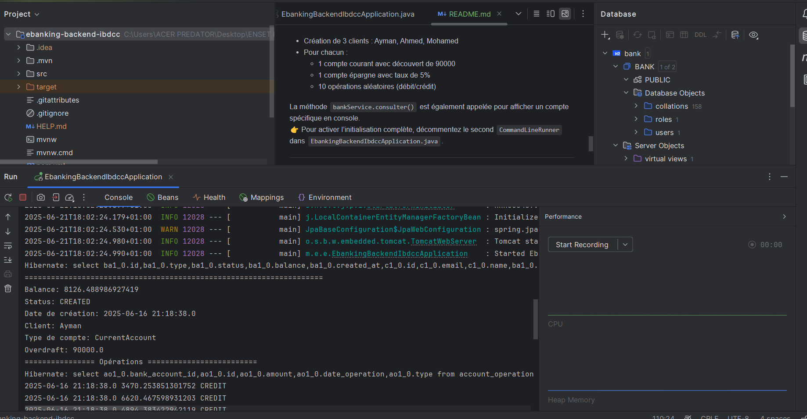

# 💸 E-bankSpringAngular

Une application bancaire full-stack développée avec **Spring Boot** pour le backend (`ebanking-backend-ibdcc`) et **Angular** pour le frontend. Elle permet la gestion de clients, de comptes bancaires, d’opérations (débits, crédits, virements), ainsi que la visualisation de l’historique des transactions.

---

## 🏗 Structure du Projet
ebanking-backend-ibdcc/
├── .idea/
├── .mvn/
├── src/
│   └── main/
│       ├── java/
│       │   └── ma/enset/ebankingbackendibdcc/
│       │       ├── dtos/
│       │       ├── entities/
│       │       │   ├── AccountOperation.java
│       │       │   ├── BankAccount.java
│       │       │   ├── CurrentAccount.java
│       │       │   ├── Customer.java
│       │       │   └── SavingAccount.java
│       │       ├── enums/
│       │       │   ├── AccountStatus.java
│       │       │   └── OperationType.java
│       │       ├── mappers/
│       │       ├── repositories/
│       │       │   ├── AccountOperationRepository.java
│       │       │   ├── BankAccountRepository.java
│       │       │   └── CustomerRepository.java
│       │       ├── services/
│       │       │   └── BankService.java
│       │       ├── web/
│       │       └── EbankingBackendIbdccApplication.java


---

## ⚙️ Technologies Utilisées

### Backend
- Java 17+
- Spring Boot
- Spring Data JPA + Hibernate
- Lombok
- H2 / MySQL
- Architecture RESTful

---

## 📦 Architecture du Backend

### Packages Principaux

- `entities` : Modèles métier (`Customer`, `BankAccount`, `AccountOperation`), avec héritage entre `CurrentAccount` et `SavingAccount`
- `repositories` : Interfaces JPA pour manipuler les données (compte, client, opération)
- `services` : Logique métier (e.g. `BankService.consulter()`)
- `dtos` : Objets de transfert pour exposer proprement les données via les APIs
- `mappers` : Convertisseurs entité-DTO
- `enums` : Types d'opération (`DEBIT`, `CREDIT`) et statut de compte (`CREATED`, `ACTIVATED`, `SUSPENDED`)

---

## 🧩 Modèle Métier

- **Customer** : Représente un client de la banque
- **BankAccount** _(abstrait)_ : Attributs communs à tous les comptes
    - `CurrentAccount` : avec autorisation de découvert
    - `SavingAccount` : avec taux d'intérêt
- **AccountOperation** : Trace chaque opération (crédit ou débit) d’un compte

Héritage JPA avec `@Inheritance(strategy = InheritanceType.SINGLE_TABLE)` et `@DiscriminatorColumn` pour distinguer les types de comptes.

---

## 🧪 Exemple de Service

La méthode `BankService.consulter()` interroge un compte par ID, affiche son solde, statut, date de création, nom du client, type de compte (avec affichage conditionnel du découvert ou taux d’intérêt) et toutes les opérations associées.

---

## 🧬 Initialisation des Données (CommandLineRunner)

Au lancement :
- Création de 3 clients : Ayman, Ahmed, Mohamed
- Pour chacun :
    - 1 compte courant avec découvert de 90000
    - 1 compte épargne avec taux de 5%
    - 10 opérations aléatoires (débit/crédit)

La méthode `bankService.consulter()` est également appelée pour afficher un compte spécifique en console.  
👉 Pour activer l’initialisation complète, décommentez le second `CommandLineRunner` dans `EbankingBackendIbdccApplication.java`.

---

## ▶ Lancer l’Application

### Backend
```bash
cd ebanking-backend-ibdcc
./mvnw spring-boot:run

